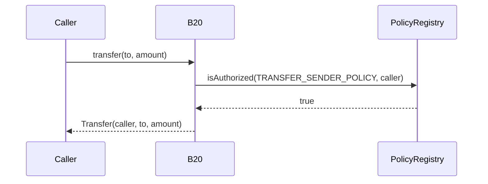
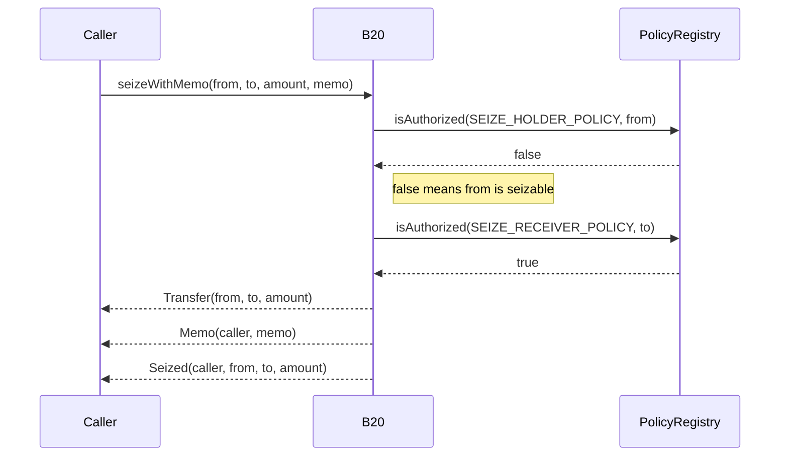
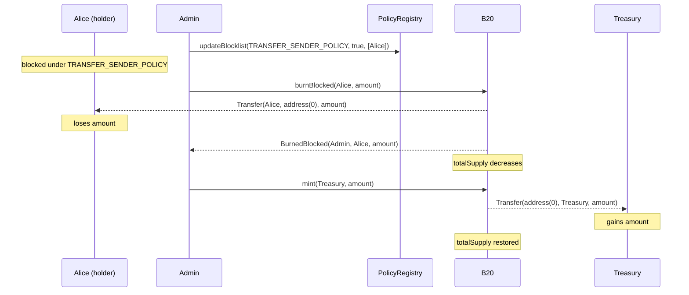
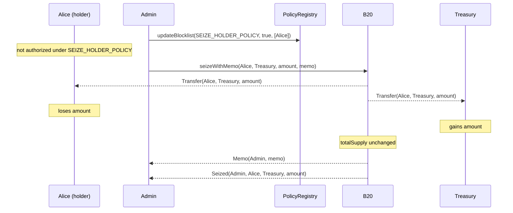

# Seize surface + burnBlocked deprecation

- **Feature Name**: seize
- **Start Date**: 2026-08-17
- **Authors**: Rayyan Alam
- **Title**: Seize surface + burnBlocked deprecation

## Summary

This change adds `seizeWithMemo` to the shared `IB20` interface so asset issuers have a dedicated seizing flow, decoupled from `burnBlocked`. The function reassigns a holder's balance to a destination in a single admin call and emits a dedicated `Seized` event after `Transfer` and `Memo`. Both B20 Asset and B20 Stablecoin inherit the function with no variant-specific logic. The `burnBlocked` function remains supported with unchanged behavior, but it is deprecated and has no committed removal date.

Two audiences are affected. Asset issuers can use `seizeWithMemo` for compliance seize workflows, gated by dedicated seize policies (`SEIZE_HOLDER_POLICY` and `SEIZE_RECEIVER_POLICY`). Indexers can use the `Seized` event to map which addresses were seized and where the balance moved.

## Motivation

Compliant asset and real-world asset (RWA) issuers must seize holder balances for court orders, sanctions, and freeze-and-reissue workflows. Issuers need a dedicated seize flow. In practice, a seizure takes assets from a specific holder (`from`) and reassigns that balance to a separate safekeeping account (`to`). The operation is not a burn or a mint because `totalSupply` does not change. After the seizure, the safekeeping account is an ordinary holder. It can transfer the tokens back with `transfer` or `transferFrom`, burn them, or use other token operations.

Issuers originally used `burnBlocked` as a workaround. That path has three steps:

1. Block the holder under `TRANSFER_SENDER_POLICY`.
2. Call `burnBlocked` to destroy the holder's balance.
3. Call `mint` to reissue the same amount to the seize destination.

That workaround is insufficient for indexers and supply accounting. There is no dedicated seize event, so indexers cannot tell a seizure from a burn plus mint. `totalSupply` decreases on the burn and increases again on the mint. Supply-sensitive readers see a transient supply change that is not a real issuance or redemption. Holder balances also move twice: from `from` to zero, then from zero to the destination.

The workaround also couples who is seizable to who can transfer, because `burnBlocked` reads `TRANSFER_SENDER_POLICY`. The set of accounts that must be seizable is not always the same as the set blocked from transferring.

`seizeWithMemo` addresses those gaps. That path has two steps:

1. Block the holder under `SEIZE_HOLDER_POLICY` (the holder must be not authorized).
2. Call `seizeWithMemo(from, to, amount, memo)`.

The call emits `Transfer`, then `Memo`, then `Seized`. Holder balances move once from `from` to `to`. `totalSupply` does not change. Seize policy slots are independent of transfer policy.

## Background

### Policy Registry

The Policy Registry is a singleton precompile. It maintains authorization policies and answers `isAuthorized(policyId, account)`. B20 does not store the member addresses. Each B20 policy scope stores a `uint64` policy ID that points into the registry.

Issuers create a policy for a specific compliance or business rule, then attach that policy ID to a B20 scope. Because the registry is shared, more than one token can reference the same policy ID.

The registry supports these policy types:

- `ALLOWLIST`: the account is authorized only if it is in the set
- `BLOCKLIST`: the account is authorized unless it is in the set
- Composite (`UNION`, `INTERSECT`): combine existing allowlists and blocklists

Simple policies (`ALLOWLIST` and `BLOCKLIST`) hold the address lists. Composite policies reuse those lists instead of copying them.

### B20 Asset and B20 Stablecoin

B20 is a Base-native token standard that extends ERC-20. Issuers use it for stablecoins and other regulated assets. Each token stores policy IDs that point into the Policy Registry. On a gated operation, B20 asks the registry whether the relevant account is authorized. For example, a `transfer`:




Existing policy scopes include:

- `TRANSFER_SENDER_POLICY`: the `from` of `transfer` and `transferFrom`
- `TRANSFER_RECEIVER_POLICY`: the `to` of `transfer` and `transferFrom`
- `TRANSFER_EXECUTOR_POLICY`: the `msg.sender` of `transferFrom`
- `MINT_RECEIVER_POLICY`: the `to` of `mint`

The `burnBlocked` workaround in Motivation uses `BURN_BLOCKED_ROLE` and `TRANSFER_SENDER_POLICY`. The holder must be not authorized under that sender policy. The call burns to `address(0)` and reduces `totalSupply`.

## Specs

### Interface Changes

The following changes add new functions, events, errors, and role/policy constants to the `IB20` interface. The deprecated `burnBlocked` function and its associated error and event remain but are marked deprecated.

```solidity
// PausableFeature enum — SEIZE appended
enum PausableFeature {
    TRANSFER,
    MINT,
    BURN,
    SEIZE
}

error AccountNotSeizable(address account);

event Seized(address indexed caller, address indexed from, address indexed to, uint256 amount);

function SEIZE_ROLE() external view returns (bytes32);

function SEIZE_HOLDER_POLICY() external view returns (bytes32);
function SEIZE_RECEIVER_POLICY() external view returns (bytes32);

/// @notice Seizes `amount` of `from`'s balance and reassigns it to `to` in a single admin operation.
///         Emits `Transfer`, then `Memo`, then `Seized`.
function seizeWithMemo(address from, address to, uint256 amount, bytes32 memo) external;

// DEPRECATED — retained for back-compat
function burnBlocked(address from, uint256 amount) external;
```

**Deprecated (dialable, unchanged behavior, no removal date committed):**


| Symbol                                         | Selector / topic0                                                    |
| ---------------------------------------------- | -------------------------------------------------------------------- |
| `burnBlocked(address,uint256)`                 | `0xec0cf3dc`                                                         |
| `error AccountNotBlocked(address)`             | `0x64a5cb46`                                                         |
| `event BurnedBlocked(address,address,uint256)` | `0x0b552e96653fd6842da37c477005d3b5c08a8c7d3631b1f43787b2dc9a1006a3` |


**New additions:**


| Symbol                                                                                           | Selector / topic0 / value                                                                      |
| ------------------------------------------------------------------------------------------------ | ---------------------------------------------------------------------------------------------- |
| `seizeWithMemo(address,address,uint256,bytes32)`                                                 | `0xf916d81b`                                                                                   |
| `SEIZE_ROLE()`                                                                                   | `0x3c7e9ba5` (role value `0x3469b8b0d89e9604f8510ed143f74a8336d22955d4f83e23bf53d9414e27f432`) |
| `SEIZE_HOLDER_POLICY()`                                                                          | `0xb279d311` (value `0x1497ab2b67ebb0a75dd9cdd6aec9f0e64620e6b87e911af7a088ac12e58d9ef2`)      |
| `SEIZE_RECEIVER_POLICY()`                                                                        | `0xb31da27f` (value `0xbf15b19caf5c77422c038bc25f26b8b815c3a14f6d04c6616076b81bcfe07b3d`)      |
| `event Seized(address indexed caller, address indexed from, address indexed to, uint256 amount)` | `0xa9aec5d8b86e2fa2fd6ac3af62f2622e3dfdab1967d4cbbb56a5df7d74cb887c`                           |
| `error AccountNotSeizable(address)`                                                              | `0x91dbbc8d`                                                                                   |
| `PausableFeature.SEIZE`                                                                          | Enum value appended after `BURN`                                                               |


### Behavioural Changes

**New function `seizeWithMemo(from, to, amount, memo)` execution flow:**

1. Check that `SEIZE` is not paused; else revert `ContractPaused(SEIZE)`.
2. Check that the caller holds `SEIZE_ROLE`; else revert `AccessControlUnauthorizedAccount`.
3. Reject zero or self destinations; else revert `InvalidReceiver`.
4. Reject zero source; else revert `InvalidSender`.
5. Require `from` to be not authorized under `SEIZE_HOLDER_POLICY`; else revert `AccountNotSeizable`.
6. Require `to` to be allowed by `SEIZE_RECEIVER_POLICY`; else revert `PolicyForbids(SEIZE_RECEIVER_POLICY, ...)`.
7. Check balance; else revert `InsufficientBalance`.
8. Emit `Transfer`, then `Memo`, then `Seized`.




**Policy polarity and defaults:**

- `SEIZE_HOLDER_POLICY` is inverted. The call proceeds only when `isAuthorized(SEIZE_HOLDER_POLICY, from)` is false. An unset slot is `0` (always-allow), so every account is authorized meaning that no account is seizable until the issuer attaches a policy.
- `SEIZE_RECEIVER_POLICY` is a normal allow check. The call proceeds only when `isAuthorized(SEIZE_RECEIVER_POLICY, to)` is true. An unset slot is `0` (always-allow), so any destination can receive seized assets.
- `seizeWithMemo` checks `SEIZE_HOLDER_POLICY` and `SEIZE_RECEIVER_POLICY`. It does not check `TRANSFER_SENDER_POLICY` or `TRANSFER_RECEIVER_POLICY`. Blocking a holder from transferring does not make them seizable. Authorizing a transfer receiver does not authorize them as a seize destination.

**Storage layout change:** A packed `seizePolicyIds` slot is added at offset 14 in the `base.b20` ERC-7201 namespace. The change is additive. Offsets 0–13 and `burnBlocked` storage are unchanged. The reserved lane in the transfer packed slot (offset 9, bits 192–255) is not used.

- Namespace location: `0xc78b71fee795ddd74aff64ea9b2474194c938c3196430e10bb5f01ed48434000`
- Placed at `SEIZE_POLICY_IDS_OFFSET = 14`

The field is packed into a single 256-bit slot:


| Bits    | Lane | Field      | Scope                   |
| ------- | ---- | ---------- | ----------------------- |
| 0–63    | 0    | `seizable` | `SEIZE_HOLDER_POLICY`   |
| 64–127  | 1    | `receiver` | `SEIZE_RECEIVER_POLICY` |
| 128–255 | 2–3  | reserved   | unused, pinned to zero  |


### Examples

**Before (old block + burn + mint workaround, still available, deprecated):**

The token's `TRANSFER_SENDER_POLICY` already points at a blocklist. Tokens leave Alice, hit `address(0)`, then land on the treasury. `totalSupply` decreases and is restored.

1. `updateBlocklist(TRANSFER_SENDER_POLICY, true, [Alice])` — add Alice to the blocklist.
2. Call `burnBlocked(Alice, amount)` — burns Alice's balance, gated by `BURN_BLOCKED_ROLE`.
3. Call `mint(Treasury, amount)` — separately reissues the same amount, gated by `MINT_ROLE`.
4. Emits: `Transfer(Alice, address(0), amount)` + `BurnedBlocked(Admin, Alice, amount)` + `Transfer(address(0), Treasury, amount)` — two independent operations.




**After (new, single call):**

The token's `SEIZE_HOLDER_POLICY` already points at a blocklist. Tokens move Alice → treasury. `totalSupply` does not change.

1. `updateBlocklist(SEIZE_HOLDER_POLICY, true, [Alice])` — add Alice to the blocklist.
2. Call `seizeWithMemo(Alice, Treasury, amount, memo)` — gated by `SEIZE_ROLE`.
3. Emits, in order:
  - `Transfer(Alice, Treasury, amount)`
  - `Memo(Admin, memo)`
  - `Seized(Admin, Alice, Treasury, amount)`




## Design Decisions & Alternatives Considered

### Design Decisions

`seizeWithMemo` and `burnBlocked` use fully independent policy slots and pause vectors.

- `seizeWithMemo` uses the new `SEIZE_HOLDER_POLICY` for `from` and `SEIZE_RECEIVER_POLICY` for `to` so that seizure eligibility and destinations are configured independently from transfer authorization. Changing a transfer policy therefore cannot implicitly make an account seizable or approve a seizure destination.
- The new `SEIZE_ROLE` separates authority to seize from other administrative permissions. The new `PausableFeature.SEIZE` also makes seizure an independently pausable operation, so an issuer can stop seizures without pausing transfers or burns.
- `SEIZE_HOLDER_POLICY` intentionally inverts the allowlist-style check used by `transfer` and `transferFrom`. `seizeWithMemo` reverts when `isAuthorized(SEIZE_HOLDER_POLICY, from)` is true, so only accounts denied by the policy are seizable. Because an unset slot reads as `0` (always allow), no account is seizable until the issuer explicitly configures the policy. This polarity also matches the existing blocked-account model, which lets issuers apply the same denylist logic used for blocked transfer and burn restrictions.
- `burnBlocked` retains `TRANSFER_SENDER_POLICY`, `BURN_BLOCKED_ROLE`, and the `BURN` pause vector because burning and seizing have different effects and must remain independently configurable. Keeping the existing controls unchanged also preserves current `burnBlocked` behavior.
- `seizeWithMemo` gets its own packed `seizePolicyIds` slot because seizure is a rare, cold-path operation. The reserved lane in the transfer packed policy slot remains available for a future transfer-side policy, where packing another hot-path check into the existing slot could avoid a second `SLOAD`.

### Alternatives

- **Shared seize policy:** A shared seize-policy approach was rejected: burning and seizing have different effects (see Behavioural Changes), so `burnBlocked` remains independent and no `burnBlockedWithMemo` variant is included.
- **Function name:** The name `transferFromBlockedWithMemo` was considered and rejected. `seizeWithMemo` names the intent (seizure) rather than the mechanism (blocked transfer).

## Implications for Integrators

For pooled-balance integrators, `seizeWithMemo` and `burnBlocked` create a path for funds to move without the regular transfer flow. This matters for systems that keep internal vault accounting against one on-chain token balance, such as lending-protocol vaults, AMM pools, staking contracts, custodial wallets, and bridges. The mechanism acts at the pooling contract's address, not at individual depositor-share granularity, so the accounting impact falls on the pool as a whole.

This is not a new risk. `burnBlocked` (still dialable, deprecated) already lets an issuer zero a blocked address's balance through block, burn, and reissue elsewhere. `seizeWithMemo` does not expand who is exposed. The change is operational: `seizeWithMemo` collapses that workaround into one call, redirects the balance instead of burning and reissuing it, and emits a dedicated `Seized` event. Both paths remain live. If an integrator contract is blocked under `TRANSFER_SENDER_POLICY` or not authorized under `SEIZE_HOLDER_POLICY`, funds can move out of that contract without the regular transfer flow.

Issuers can check current exposure by reading the policy IDs assigned to `SEIZE_HOLDER_POLICY` and `TRANSFER_SENDER_POLICY` with `token.policyId(...)` (`IB20.policyId`, `src/interfaces/IB20.sol`). Then they can query the Policy Registry's `isAuthorized(policyId, account)` with the pooling contract's own address against each ID. If the contract is not authorized under the seize-holder policy, or is blocked under the transfer-sender policy, funds can be seized or burned from that vault balance under the current configuration. This check is only point-in-time. An issuer can later change either slot with `updatePolicy`, so "not seizable today" is not a strong guarantee.

## Migration Steps

**Backwards-compatible:** `burnBlocked` continues to work unchanged. No action is required if you do not need seize behavior yet.

**No breaking changes:** All existing selectors, events, and errors remain dialable.

**To adopt `seizeWithMemo`:**

1. Grant `SEIZE_ROLE` to the account(s) that should be able to seize. With no `SEIZE_ROLE` holders, no one can seize.
2. Configure `SEIZE_HOLDER_POLICY` so the accounts you want seizable are NOT authorized under it. With no policy configured (unset = always-allow), no account is seizable.
3. Optionally configure `SEIZE_RECEIVER_POLICY` to restrict where seized funds may land. Unset defaults to always-allow (for example, an unallowlisted treasury still works).

**To reproduce `burnBlocked`'s destroy-supply outcome with seize:** `seizeWithMemo` alone does not reduce `totalSupply`.

1. Call `seizeWithMemo` with a treasury or self-controlled address as `to`.
2. Call `burn(amount)` from that address to destroy the seized supply.

**No storage migration:** `burnBlocked`'s storage and behavior are untouched by this change.