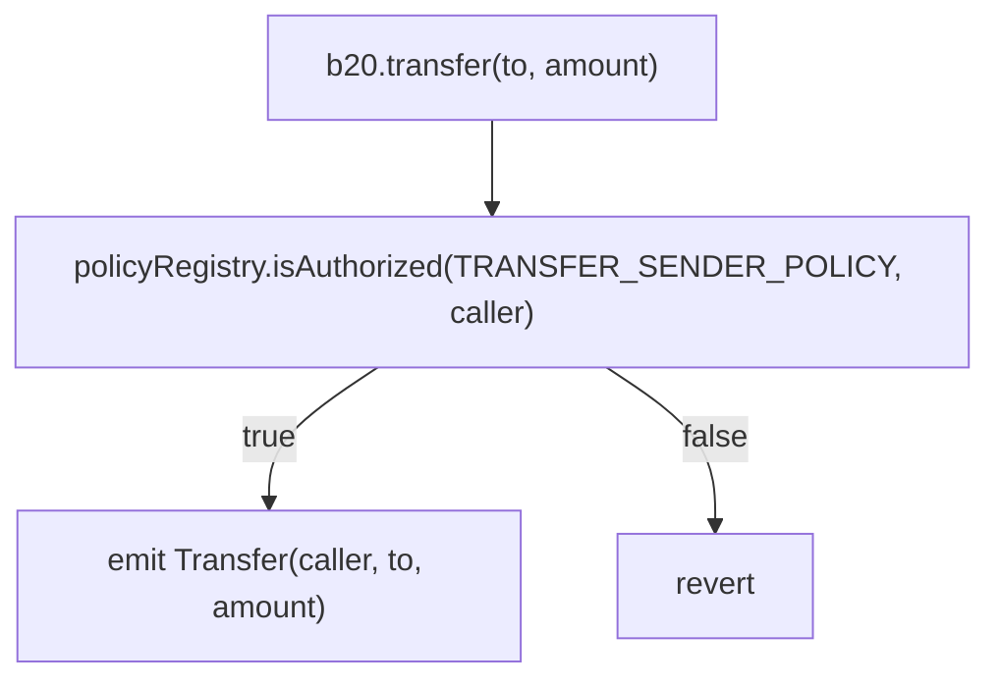
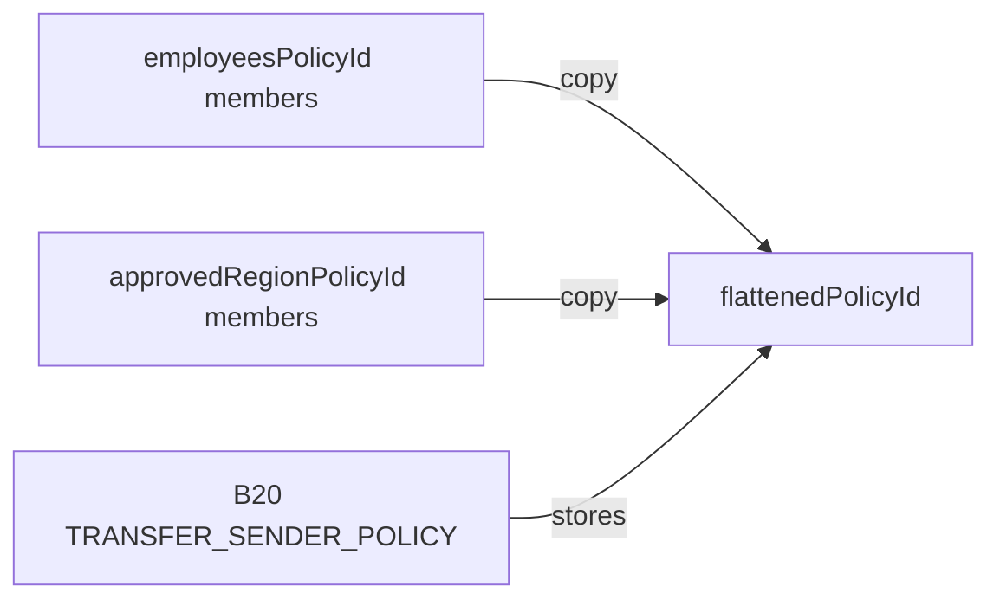
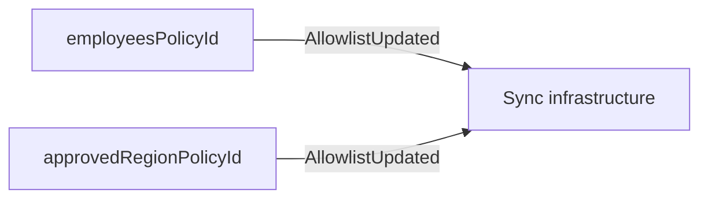
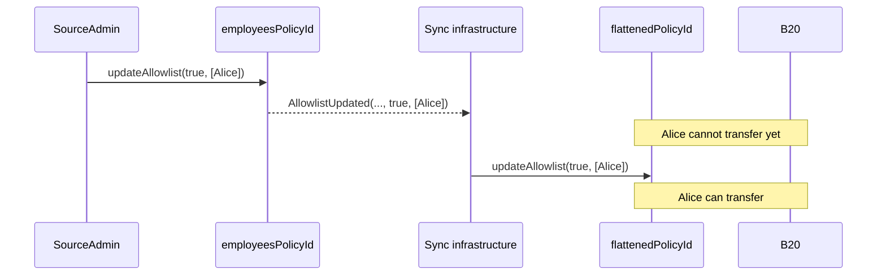
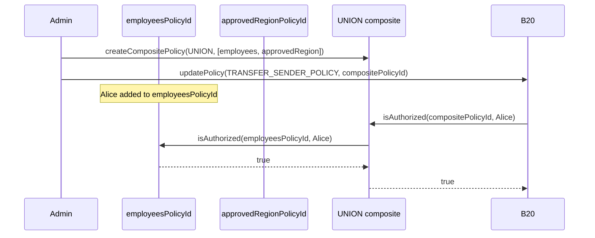

# Composite Policies (UNION/INTERSECT)

- **Feature Name**: composite_policy
- **Start Date**: 2026-08-17
- **Authors**: Rayyan Alam
- **Title**: Composite Policies (UNION/INTERSECT)

## Summary

Asset issuers use the Policy Registry to enforce compliance on their tokens. Any token can reference any policy, including a list the issuer maintains and a shared list another policy owner maintains — for example a KYC allowlist or a sanctions blocklist. Combining those policies previously required flattening them into a new list.

This feature adds composite policies so issuers can combine those lists without flattening. A `UNION` (OR) policy authorizes an account if any child policy authorizes it. An `INTERSECT` (AND) policy authorizes an account only if every child policy authorizes it.

Each composite references two to four existing simple policies (`ALLOWLIST` or `BLOCKLIST`). Composite policies cannot reference other composites; the registry enforces this constraint when a composite is created or updated. Authorization uses each child's current state, so updating a child automatically affects every composite that references it.

## Motivation

Asset issuance platforms often manage many assets that share authorization requirements. An issuer can reuse one policy across these assets, but assigning that policy directly leaves no way to customize authorization for an individual asset.

Without a way to combine policies, users must copy entries from source policies into a new, flattened policy and operate infrastructure that monitors and synchronizes every source update. This approach duplicates policy data and can leave the copy stale when synchronization is delayed or fails. Until the copy catches up, valid transfers can be rejected or transfers that the source policy no longer authorizes can proceed.

Access control can also require more than one condition. An application might require both KYC verification and ProUser status, or accept either ProUser status or LifetimeUser status. A single simple policy cannot express those AND or OR relationships across independent lists.

Composite policies address both cases without flattening. A `UNION` (OR) policy authorizes an account if any child authorizes it, so an issuer can combine a shared allowlist with a token-specific allowlist. An `INTERSECT` (AND) policy authorizes an account only if every child authorizes it, so an issuer can require both KYC verification and ProUser status. Authorization evaluates each child's current state, so one child update immediately applies to every composite that references it, without list-copying infrastructure.

## Background

### B20 Token

B20 is a token precompile that uses policies to restrict operations such as transfers, minting, and seizing. For each restricted operation, B20 stores a Policy Registry policy ID in a dedicated policy scope. When an operation is attempted, B20 passes that policy ID and the account address to the Policy Registry, and rejects the operation if the account is not authorized.

For example, a `transfer`:




### Policy Registry

The Policy Registry is a singleton precompile that stores policies. B20 tokens consult it by calling `isAuthorized(policyId, account)` with the policy ID from the relevant scope, including `TRANSFER_FROM`, `TRANSFER_TO`, and `SEIZE_HOLDER`.

Existing policies are simple `ALLOWLIST` and `BLOCKLIST` types, and they are the only valid children of a composite.

## Specs

### Interface Changes

The `IPolicyRegistry` interface changes are as follows:

```solidity
enum PolicyType {
    BLOCKLIST,
    ALLOWLIST,
    UNION,
    INTERSECT
}

error ChildPoliciesOutsideOfRange();
error InvalidChildPolicy(uint64 childPolicyId);

event CompositePolicyUpdated(uint64 indexed policyId, address indexed updater, uint64[] childPolicyIds);

function createCompositePolicy(address admin, PolicyType policyType, uint64[] calldata childPolicyIds)
    external
    returns (uint64 newPolicyId);

function updateComposite(uint64 policyId, uint64[] calldata childPolicyIds) external;

function compositePolicyChildIds(uint64 policyId) external view returns (uint64[] memory);

function MIN_COMPOSITE_CHILD_POLICIES() external view returns (uint256);
function MAX_COMPOSITE_CHILD_POLICIES() external view returns (uint256);
```

| Symbol | Selector / Topic0 | Status | Notes |
| ------ | ----------------- | ------ | ----- |
| `createCompositePolicy(address,uint8,uint64[])` | `0x6fdd1491` | NEW | `PolicyType` ABI-encodes as `uint8`; creates a UNION/INTERSECT composite |
| `updateComposite(uint64,uint64[])` | `0xbfe142c0` | NEW | Full replacement of the child set |
| `compositePolicyChildIds(uint64)` | `0x7c40df74` | NEW (view) | Returns the stored child set verbatim; empty for non-composites |
| `MIN_COMPOSITE_CHILD_POLICIES()` | `0xb3ae29f7` | NEW (view) | Returns `2` |
| `MAX_COMPOSITE_CHILD_POLICIES()` | `0x54309870` | NEW (view) | Returns `4` |
| `ChildPoliciesOutsideOfRange()` | `0x697ec868` | NEW (error) | Child count not in `[2, 4]`; distinct from `BatchSizeTooLarge` (64-account cap) |
| `InvalidChildPolicy(uint64)` | `0x46508ef6` | NEW (error) | Child is itself a composite or a built-in sentinel |
| `CompositePolicyUpdated(uint64,address,uint64[])` | `0x4ff6adaab31b0df87aa7b8b7320c52b8b3b5eede3bf28a6baaaa8b8b7e1d6363` | NEW (event) | Topic0; emitted on composite create and every update; carries full post-update set |
| `isAuthorized(uint64,address)` | (unchanged) | extended | Now dispatches composites (live child evaluation); signature unchanged |
| `createPolicy(address,uint8)` | `0xca5d55f6` | extended | Now rejects `UNION`/`INTERSECT` with `IncompatiblePolicyType` (see below) |
| `createPolicyWithAccounts(address,uint8,address[])` | `0xa2d3044f` | extended | Same new `IncompatiblePolicyType` rejection |

The `PolicyType` enum adds two values. `UNION` (`2`) authorizes an account if any child policy authorizes it (OR). `INTERSECT` (`3`) authorizes an account only if every child policy authorizes it (AND).

#### `createCompositePolicy(admin, policyType, childPolicyIds)`

`createCompositePolicy` creates a `UNION` or `INTERSECT` policy, sets `admin` as the initial admin, and returns the new policy ID. The function stores `childPolicyIds` as references to existing simple policies. It does not copy child membership, so later `isAuthorized` calls read each child's current state.

`childPolicyIds` must contain between `MIN_COMPOSITE_CHILD_POLICIES` (`2`) and `MAX_COMPOSITE_CHILD_POLICIES` (`4`) entries. Each child must be an existing `ALLOWLIST` or `BLOCKLIST` policy. Composite policies and the built-in `ALWAYS_ALLOW` and `ALWAYS_BLOCK` policies are not valid children.

Each child that `isAuthorized` evaluates requires a membership storage read. Gas therefore increases with the number of children evaluated, and is highest when all four children are evaluated.

The function reverts in this order:

1. `ZeroAddress` (admin)
2. `IncompatiblePolicyType` (policyType not UNION/INTERSECT)
3. `ChildPoliciesOutsideOfRange` (count not in `[2, 4]`)
4. `PolicyNotFound` (a child does not exist, checked as one pass over the whole set)
5. `InvalidChildPolicy` (a child is itself composite or sentinel, checked as a second pass)

The function emits these events in this order:

- `PolicyCreated(policyId, creator, policyType)`
- `PolicyAdminUpdated(policyId, address(0), admin)`
- `CompositePolicyUpdated(policyId, creator, childPolicyIds)`

#### `updateComposite(policyId, childPolicyIds)`

`updateComposite` replaces the entire child set with two to four existing simple policies. The same validation rules as `createCompositePolicy` apply. The function does not support a partial update or an empty child set.

The function reverts in this order:

1. `PolicyNotFound` (the composite itself does not exist)
2. `IncompatiblePolicyType` (`policyId` is a simple policy)
3. `Unauthorized` (the caller is not the current admin — this check runs before the child-count check)
4. `ChildPoliciesOutsideOfRange`
5. `PolicyNotFound` (a new child does not exist)
6. `InvalidChildPolicy`

The function emits `CompositePolicyUpdated(policyId, updater, childPolicyIds)`. It does not emit `PolicyAdminUpdated` because the admin does not change.

### Behavioural Changes

#### Existing Functions with Changed Revert Behavior

`createPolicy` and `createPolicyWithAccounts` create simple policies. They revert with `IncompatiblePolicyType` when `policyType` is `UNION` or `INTERSECT`.

#### Authorization Implementation

`isAuthorized` now evaluates `UNION` and `INTERSECT` policies as follows:

```text
isAuthorized(policyId, account):
    if policy is ALLOWLIST:
        return account is in the policy

    if policy is BLOCKLIST:
        return account is not in the policy

    if policy is UNION:
        for each child policy:
            if isAuthorized(child, account):
                return true
        return false

    if policy is INTERSECT:
        for each child policy:
            if not isAuthorized(child, account):
                return false
        return true
```

#### Authorization Details

Composite creation and updates reject composite children, so evaluation never recurses. Each child is a simple `ALLOWLIST` or `BLOCKLIST`. Each child returns one authorization result, and the composite only combines those results.

Evaluation is live, not a snapshot: each call reads the current membership of each evaluated child.

Evaluation also short-circuits. `UNION` stops at the first authorizing child, and `INTERSECT` stops at the first non-authorizing child. Child order cannot change the authorization result. It can change gas, because gas depends on how many children are evaluated. Put the child most likely to short-circuit first.

Duplicate child IDs are allowed. The registry preserves their order and does not deduplicate them. `updateComposite` requires two to four children, so an existing composite cannot become empty or undersized.

A child remains effective if its admin renounces. Renouncing freezes future membership changes but does not delete the child or change its current authorization results.

A well-formed but never-created `UNION` ID has no children and returns `false`. A well-formed but never-created `INTERSECT` ID has no children and returns `true`. Consumers that store policy IDs MUST call `policyExists(policyId)` before storing them. Otherwise an invalid `INTERSECT` ID behaves like `ALWAYS_ALLOW`.

#### State Changes

A `children` mapping is added at offset 4 in the `base.policy_registry` ERC-7201 namespace. The change is additive. Existing state at offsets 0–3 is unchanged, and no storage migration is needed. Offset 4 is relative to the namespace location, not literal EVM slot 4.

- Namespace location: `0x00503aeb06982fa1fe3151dc68f90b3946c55c449dfd447e49dcaece71ba4a00`
- Placed at `CHILDREN_OFFSET = 4`
- Field type: `mapping(uint64 policyId => uint64[] childPolicyIds) children`

For each `policyId`, the mapping entry stores the dynamic array length. Array elements start at the hash of that entry and pack four `uint64` child policy IDs into each 256-bit slot. The two-to-four-child limit means each composite uses one element slot.

| Bits    | Array index | Field                  |
| ------- | ----------- | ---------------------- |
| 0–63    | 0           | `childPolicyIds[0]`    |
| 64–127  | 1           | `childPolicyIds[1]`    |
| 128–191 | 2           | `childPolicyIds[2]`    |
| 192–255 | 3           | `childPolicyIds[3]`    |

Simple and composite policies share the global `nextCounter`. The counter starts at 2 because `0` and `1` are reserved for `ALWAYS_ALLOW` and `ALWAYS_BLOCK`. A composite policy ID encodes `PolicyType` in the top byte and the next available counter value in the low 56 bits. This is the same encoding scheme that simple policies use. Composite policies do not use a separate counter.

### Examples

Assume existing simple policies: `employeesPolicyId` (ALLOWLIST) and `approvedRegionPolicyId` (ALLOWLIST). Both Before and After combine them so an account may transfer if it is on either list.

#### Before (Flattened Policy)

B20 stores one policy ID per scope, so the two allowlists must be copied into a new flattened allowlist. Off-chain infrastructure then has to keep that copy aligned with both sources.

**1. Flatten once**

Read the members of `employeesPolicyId` and `approvedRegionPolicyId`. Create a new allowlist with that union, then point B20 at the copy.

```solidity
flattenedPolicyId = policyRegistry.createPolicyWithAccounts(
    admin,
    ALLOWLIST,
    [/* union of employees and approved-region addresses */]
)
b20.updatePolicy(TRANSFER_SENDER_POLICY, flattenedPolicyId)
```



**2. Listen to both sources**

Watch `AllowlistUpdated` on `employeesPolicyId` and `approvedRegionPolicyId`. A change on either list is not visible to B20 until the listener writes it into the flattened copy.



**3. Propagate the change**

On each event, copy the membership delta into `flattenedPolicyId` with `updateAllowlist`, or rebuild a new flattened allowlist and call `updatePolicy` again. Until that transaction lands, an account added to a source list is still rejected, and an account removed from a source list can still transfer.



#### After (Composite Policy)

Create a `UNION` composite that references the two source policies. Do not copy their members.

```solidity
policyRegistry.createCompositePolicy(admin, UNION, [employeesPolicyId, approvedRegionPolicyId])
```

The call emits `PolicyCreated(policyId, admin, UNION)`, then `PolicyAdminUpdated(policyId, 0, admin)`, then `CompositePolicyUpdated(policyId, admin, [children])`.

Assign the composite to B20:

```solidity
b20.updatePolicy(TRANSFER_SENDER_POLICY, compositePolicyId)
```

B20 has no composite-specific logic. It passes the policy ID to the registry as usual. Adding Alice to `employeesPolicyId` authorizes her on the next check, with no recopy.



## Design Decisions & Alternatives Considered

The chosen design uses two explicit policy types (`UNION` and `INTERSECT`), a single `createCompositePolicy` function, and full-replacement `updateComposite`.

**Alternative 1: One generic COMPOSITE type**

This alternative stores a separate operator (AND, OR, NOT, XOR) in composite storage. It was rejected because it requires storing both a composite flag and the operator, adds storage reads or more complicated ID encoding, and enlarges the gas and audit surface before there is a requirement for NOT, XOR, or nested expressions.

**Alternative 2: Token-level policy groups**

This alternative keeps Policy Registry unchanged and has each B20 token store multiple policy IDs plus an operator. It was rejected because composite policies would not be reusable entities, the change would spread across B20, token variants, factories, and token hot paths, and one composite could not be shared across multiple tokens.

**Alternative 3: Incremental child updates**

This alternative provides `addCompositeOperand` and `removeCompositeOperand` functions. It was rejected because the child list is capped at 4 entries, and dynamic-array mutation requires swap/remove, length, and deduplication logic. Full replacement is atomic, and the caller can resend the complete list at low cost.

**Alternative 4: Separate creator functions**

This alternative uses `createUnionPolicy` and `createIntersectPolicy`. It was rejected because it doubles the creation API surface. A single `createCompositePolicy` keeps policy creation consistent, and future operators would each require another function.

**Alternative 5: Nested composites (a composite referencing another composite)**

This alternative allows composite children to some bounded depth, instead of restricting children to simple `ALLOWLIST` and `BLOCKLIST` policies. It was rejected because restricting children to simple policies guarantees that `isAuthorized` recursion terminates at depth 1, with no cycle risk and no unbounded traversal. That bound also limits worst-case gas and the audit surface of authorization evaluation. There is no demonstrated need for nested expressions. A wrapper composite can be introduced later if one arises.

## Migration Steps

This change is not breaking. All existing selectors, events, and errors remain dialable at Cobalt, and existing simple policies (`ALLOWLIST` and `BLOCKLIST`) continue to work unchanged. If you do not need composite behavior, you do not need to take any action.

If you currently flatten multiple lists into one policy, migrate as follows:

1. Identify the simple policies you want to combine.
2. Call `policyRegistry.createCompositePolicy(admin, UNION or INTERSECT, [childPolicyIds])`.
3. Point the B20 token's policy scope at the new composite policy ID with `b20.updatePolicy(TRANSFER_SENDER_POLICY, compositePolicyId)`. No B20 contract change is required. B20 treats the composite ID as an opaque `uint64`, exactly like a simple policy ID.
4. Remove the old flattened policy if it is no longer needed.
