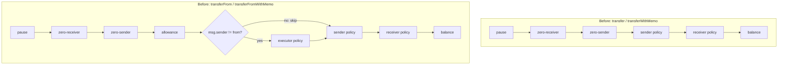
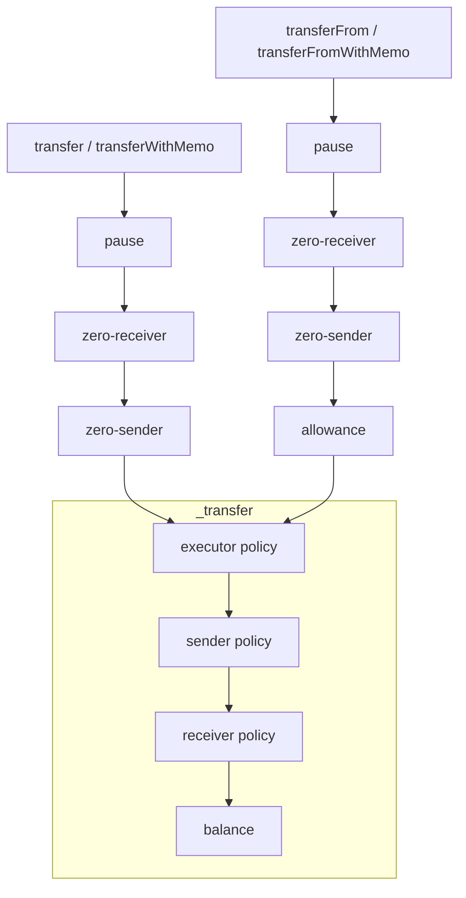

# Transfer Executor Policy Enforcement

- **Feature Name**: transfer_executor_enforcement
- **Start Date**: 2026-09-10
- **Authors**: Rayyan Alam
- **Title**: (Breaking) Transfer Executor Policy Enforcement

## Summary

This change makes `TRANSFER_EXECUTOR_POLICY` apply to every transfer path. The executor gate now checks `msg.sender` on `transfer`, `transferFrom`, `transferWithMemo`, and `transferFromWithMemo`, including when `msg.sender == from`. Previously the check ran only on the delegated `transferFrom` paths, and only when `msg.sender != from`.

The change is purely behavioral. It adds no new selectors, events, errors, or storage. A token that never sets `TRANSFER_EXECUTOR_POLICY` keeps the unset always-allow default, so it is unaffected.

## Motivation

An issuer may want an executor allowlist: only specific, approved contracts or accounts may initiate a transfer, for example a settlement contract that moves tokens on a holder's behalf. `TRANSFER_EXECUTOR_POLICY` exists for this, but the previous scope could not enforce it consistently with `TRANSFER_SENDER_POLICY` and `TRANSFER_RECEIVER_POLICY`, which already run on every transfer path.

The previous scope left two initiator-side gaps:

1. `transfer` never consulted the executor policy. The initiator of `transfer` is `msg.sender`, which is also `from`, but the check lived only inside `transferFrom`. A holder could always move their own tokens through `transfer`, regardless of the executor allowlist.
2. `transferFrom` skipped the check when `msg.sender == from`. A holder could route a self-`transferFrom(from, to, amount)` call to reach the same unchecked path, even if they were not on the executor allowlist.

Both gaps let a non-allowlisted holder move tokens by choosing a different entrypoint, so the executor scope could not express "only these initiators may move tokens" for any holder. Centralizing the check on `msg.sender` and removing the `msg.sender == from` carve-out closes both gaps and brings `TRANSFER_EXECUTOR_POLICY` to parity with the sender and receiver scopes.

## Background

### Policy Registry and transfer-side scopes

The Policy Registry is a singleton precompile that B20 tokens call for pre-operation compliance checks on an address. A B20 token stores a `uint64` policy ID per scope and calls `isAuthorized(policyId, account)` before a gated operation. `isAuthorized` never reverts; a malformed or unknown ID returns `false` (deny). See [Policies](../docs/concepts/policies.md) for the full model.

B20 has three transfer-side scopes, all checked inside the shared `_transfer` function that backs `transfer`, `transferFrom`, and their memo variants:

| Scope | Account checked |
| --- | --- |
| `TRANSFER_SENDER_POLICY` | `from` |
| `TRANSFER_RECEIVER_POLICY` | `to` |
| `TRANSFER_EXECUTOR_POLICY` | `msg.sender` |

All three scopes are bypassed during the factory bootstrap window (`_isPrivileged()`), so a token's `initCalls` can move newly minted supply without pre-authorizing itself under any of the three policies. See [`IB20Factory.createB20`](../src/interfaces/IB20Factory.sol).

`transferFrom` and `transferFromWithMemo` additionally consume the caller's allowance from `from` before reaching `_transfer`. Allowance accounting is unconditional, including during the bootstrap window, and is unaffected by this change.

## Specs

### Interface Changes

This change adds no new functions, events, errors, or selectors, changes are behavioural to the underlying Transfer Functions. 

### Behavioural Changes

The executor check moves from the `transferFrom` and `transferFromWithMemo` bodies into `_transfer`, where it runs first, before the existing sender and receiver checks, and under the same `_isPrivileged()` bootstrap bypass. The `msg.sender == from` carve-out that previously skipped the check is removed. `transfer` and `transferWithMemo` route through the same `_transfer` function, so they gain the check with no entrypoint-specific code.

The previous order, by entrypoint:



This reorders the checks a caller can hit. Both paths now enter `_transfer` for the three transfer-side policies. The canonical order is now:

- `transfer` / `transferWithMemo`: pause → zero-receiver → zero-sender → **executor policy** → sender policy → receiver policy → balance.
- `transferFrom` / `transferFromWithMemo`: pause → zero-receiver → zero-sender → allowance → **executor policy** → sender policy → receiver policy → balance.



When more than one check would fail, the caller sees the first revert in that order:

There are no new storage slots. The `TRANSFER_EXECUTOR_POLICY` policy ID is read from the same packed slot as before; `_transfer` now reads all three transfer-side policy IDs from that slot in one `SLOAD` instead of the executor lane being pre-warmed by a separate read in `transferFrom`'s body.

### Examples

A holder moving their own tokens is now gated by the executor policy, even through direct `transfer`:

```solidity
token.updatePolicy(TRANSFER_EXECUTOR_POLICY, ALWAYS_BLOCK_ID);

vm.prank(alice);
token.transfer(bob, amount); // reverts PolicyForbids(TRANSFER_EXECUTOR_POLICY, ALWAYS_BLOCK_ID)
```

An executor allowlist restricts initiation to approved accounts. A holder who is a member can move their own tokens; one who is not, cannot:

```solidity
uint64 executorAllowlist = policyRegistry.createPolicyWithAccounts(admin, ALLOWLIST, [settlementContract]);
token.updatePolicy(TRANSFER_EXECUTOR_POLICY, executorAllowlist);

vm.prank(settlementContract);
token.transferFrom(alice, bob, amount); // succeeds: settlementContract is allowlisted

vm.prank(alice);
token.transfer(bob, amount); // reverts PolicyForbids(TRANSFER_EXECUTOR_POLICY, ...): alice is not allowlisted
```

The factory bootstrap bypass still applies. A token's `initCalls` can mint and transfer even when the freshly configured executor policy would otherwise block the factory:

```solidity
initCalls = [
    abi.encodeCall(IB20.mint, (address(factory), amount)),
    abi.encodeCall(IB20.updatePolicy, (TRANSFER_EXECUTOR_POLICY, ALWAYS_BLOCK_ID)),
    abi.encodeCall(IB20.transfer, (to, amount))
];
factory.createB20(..., initCalls); // succeeds: bootstrap window bypasses the executor check
```

## Design Decisions & Alternatives Considered

### Chosen: centralize the check in `_transfer`, on `msg.sender`

The executor check moves into the shared `_transfer` helper. `transfer`, `transferFrom`, `transferWithMemo`, and `transferFromWithMemo` already call `_transfer`, so they all run the same executor check on `msg.sender`. `transferWithMemo` and `transferFromWithMemo` therefore get the same coverage as the non-memo paths, with no entrypoint-specific code. The check has no `msg.sender == from` carve-out and still honors the existing `_isPrivileged()` bypass.

This approach was chosen because it is the smallest change that closes both gaps described in Motivation, adds no new interface surface, and brings `TRANSFER_EXECUTOR_POLICY` in line with how `TRANSFER_SENDER_POLICY` and `TRANSFER_RECEIVER_POLICY` are already enforced: once, in `_transfer`, on every path.

### Alternative — keep the check in `transferFrom` only, add it to `transfer` separately

This option would add a matching check to `transfer` while leaving the existing `transferFrom` check, including its `msg.sender != from` carve-out, in place. It was rejected because it does not close the self-`transferFrom` bypass: a holder could still route around an executor allowlist by calling `transferFrom(self, to, amount)` instead of `transfer`. It also keeps the check duplicated across two entrypoints instead of centralized in `_transfer`.

## Migration Steps

This change is not breaking for a token that never configured `TRANSFER_EXECUTOR_POLICY`. The unset policy slot stays always-allow, and the factory bootstrap bypass is unchanged, so existing deployments and initialization flows are unaffected.

This change is breaking for a token that has already set a restrictive `TRANSFER_EXECUTOR_POLICY` and relied on either of the closed bypasses:

1. If holders were moving their own tokens with `transfer`, they must now be authorized under `TRANSFER_EXECUTOR_POLICY` (directly, or through a policy they belong to) to keep doing so.
2. If holders were relying on `msg.sender == from` to skip the check in `transferFrom`, the same authorization requirement now applies to that self-call path.

An issuer who wants to keep allowing holders to self-initiate transfers should add those holders, or a policy covering them, to the executor allowlist before this change activates.
