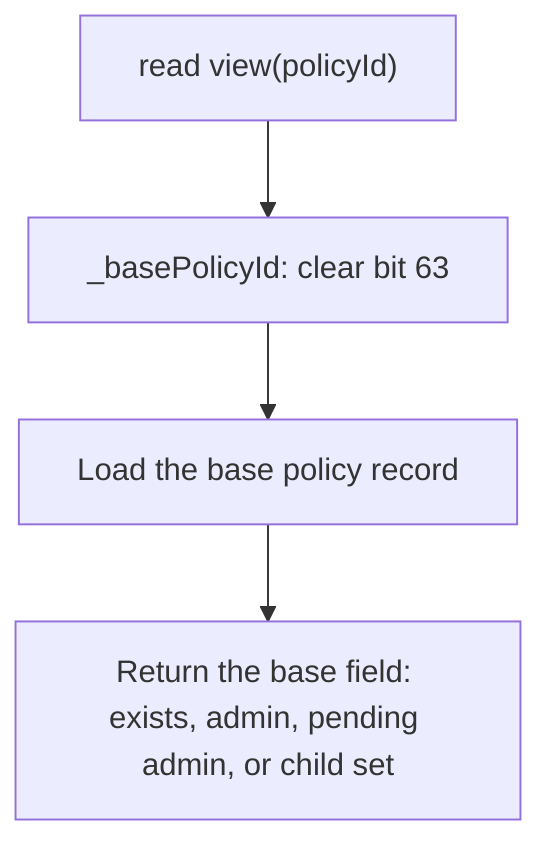
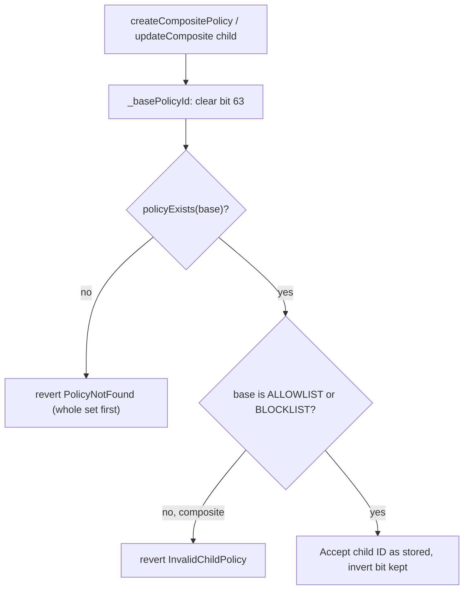

# NOT / Invert Policies

- **Feature Name**: not_policy
- **Start Date**: 2026-09-09
- **Authors**: Rayyan Alam
- **Title**: NOT / Invert Policies

## Summary

This change allows any policy ID to reference the opposite (NOT) of its original outcome at query time. When bit 63 is set, `isAuthorized` resolves the base policy and returns the opposite of that policy's decision.

Members stay on the base policy and are shared, not copied, so an update to the base updates its inverse. Invert therefore creates no new record, no new create path, and no extra storage load (`SLOAD`). The flag applies to every policy type: `ALLOWLIST`, `BLOCKLIST`, and `UNION` / `INTERSECT` composites. 

## Motivation

Issuers may want the inverse of a specific list, and the registry cannot express that. They may authorize an account only when it is not on a sanctions blocklist, or only when it is not Know Your Customer (KYC) verified. Composites often need the same negation: "allowed to transfer" is frequently "on list A and not on list B", where list B is a sanctions list, a blocked list, or a non-KYC'd list. They may also need both sides inverted: "not on list A and not on list B". There is no way to say "the opposite of this policy."

Without invert, the only way to get the opposite outcome is to create a second policy of the other type and copy the same addresses into it: an allowlist mirrored as a blocklist, or the reverse. Every membership change must then land on both policies. If one update lags, valid accounts are rejected or invalid ones are admitted. A composite that needs "NOT A" still has to point at that second, mirrored policy. It cannot reuse A.

The goal is to let one membership set be evaluated as include or exclude, so issuers never maintain two or more policies for the same address group. A composite can invert one child or several: "A AND NOT B", or "NOT A AND NOT B".

## Background

### Policy Registry

The Policy Registry is a singleton precompile at `0x8453000000000000000000000000000000000002`. B20 tokens call it for pre-operation compliance checks on an address.

B20 stores a `uint64` policy ID per scope (`TRANSFER_FROM`, `TRANSFER_TO`, `MINT_RECEIVER`, `SEIZE_EXEMPT`, and other scopes) and calls `isAuthorized(policyId, account)` before gated operations.

`isAuthorized` never reverts. A malformed or unknown ID returns `false` (deny).

### Policy ID layout

A policy ID is a `uint64` value issued by the Policy Registry. It is the link between the registry and a token: the registry stores the policy, and the token stores only the ID, then passes that ID to `isAuthorized` for each gated operation.

The structure of a policy ID is:

```text
 63              56 55                             0
+------------------+-------------------------------+
| PolicyType byte  | unique counter                |
+------------------+-------------------------------+
```

- Bits `[0:55]` hold a unique counter value. The type is not stored in a slot.
- Bits `[56:63]` are reserved for `PolicyType`. Only four types are used today (`0–3`: `BLOCKLIST`, `ALLOWLIST`, `UNION`, `INTERSECT`), occupying bits `56–57`. Bits `58–63` are unused.

## Specs

### Interface Changes

This change introduces `invertedPolicyId`, a view helper that returns the inverted version of a policy ID. Indexers, explorers, externally owned accounts (EOAs), and cross-codebase contracts can call it to obtain that form without knowing the bit layout. Bit 63 of a policy ID is now reserved as the invert bit, so the registry does not add a new create function. Consumers of the Policy Registry can set that bit themselves.

```solidity
// New constant (single source of truth, in PolicyRegistryConstants)
uint64 internal constant INVERTED_POLICY_BIT = uint64(1) << 63;

// Helper created for getting the inverted version of a  policy ID 
function invertedPolicyId(uint64 policyId) external view returns (uint64);
```

| Symbol | Selector / Topic0 | Status | Notes |
| ------ | ----------------- | ------ | ----- |
| `invertedPolicyId(uint64)` | `0x6b468933` | NEW (view) | Pure toggle of bit 63 (`policyId ^ INVERTED_POLICY_BIT`); never reverts, reads no state, involutive |
| `isAuthorized(uint64,address)` | (unchanged) | extended | An inverted ID resolves the base and returns the negated result; fail-closed on an unknown/malformed base |
| `policyExists(uint64)` | (unchanged) | extended | Strips to base: `policyExists(invertedPolicyId(id)) == policyExists(id)` |
| `policyAdmin(uint64)` | (unchanged) | extended | Strips to base: `policyAdmin(invertedPolicyId(id)) == policyAdmin(id)` |
| `pendingPolicyAdmin(uint64)` | (unchanged) | extended | Strips to base |
| `compositePolicyChildIds(uint64)` | (unchanged) | extended | Strips the queried composite's own flag; child IDs returned **verbatim**, including any per-child invert |
| `createCompositePolicy(address,uint8,uint64[])` | (unchanged) | extended | A child ID may carry the invert flag ("A AND NOT X"); validated against its base |
| `updateComposite(uint64,uint64[])` | (unchanged) | extended | Same per-child invert handling |

`invertedPolicyId` does not check existence. A missing or malformed base is denied later, at `isAuthorized`.

### Behavioural Changes

#### Authorization

`isAuthorized` gains a leading invert branch. All non-inverted paths are byte-identical to today.

```text
isAuthorized(policyId, account):
    if policyId has INVERTED_POLICY_BIT set:
        base = policyId without the bit
        if not policyExists(base):      # fail-closed guard
            return false
        return not isAuthorized(base, account)

    ... existing ALLOWLIST / BLOCKLIST / UNION / INTERSECT dispatch ...
```

The invert applies to every policy type. Inverting a composite negates the composite's combined result.

#### Getters strip to base

Read views do not look up an inverted ID as its own policy. They strip bit 63 with a shared `_basePolicyId(id) = id & ~INVERTED_POLICY_BIT` helper and read the base. An inverted ID therefore has no record of its own: it mirrors the base's existence, admin, pending admin, and child set. A token can store an inverted policy ID and later re-validate it exactly as it would a plain one.



#### Composite children

A composite child ID may carry the invert bit. The registry evaluates that child as the inverse of its base, and it checks existence and simple type against the base. An inverted simple child is valid. An inverted composite child is rejected (`InvalidChildPolicy`), which preserves the flat-tree invariant. Across the whole child set, `PolicyNotFound` still takes precedence over `InvalidChildPolicy`.



#### State / gas

There are no new storage slots. Invert is query-time only. Storage keys, type decode, and existence always resolve against the issued (stripped) ID.

Eval is the existing dispatch plus one boolean flip in memory. There is no extra `SLOAD`.

### Examples

Given a sanctions `BLOCKLIST` `sanctionsId` (authorized means not sanctioned):

```solidity
uint64 notSanctions = policyRegistry.invertedPolicyId(sanctionsId); // sanctionsId ^ (1 << 63)
```

"Allowed to transfer = on `kycId` AND not on `sanctionsId`" via a composite with an inverted child:

```solidity
uint64 notSanctions = policyRegistry.invertedPolicyId(sanctionsId);
policyRegistry.createCompositePolicy(admin, INTERSECT, [kycId, notSanctions]);
```

Fail-closed: for any never-created base, `isAuthorized(base | INVERTED_POLICY_BIT, account) == false`. The inverted unknown ID never becomes allow-everyone.

Round-trip: `invertedPolicyId(invertedPolicyId(id)) == id` (involutive). `policyExists(notSanctions) == policyExists(sanctionsId)`.

## Design Decisions & Alternatives Considered

Three options were weighed. The team converged on Option 2 (invert bit on the ID), implemented as Option 2a: Option 2 plus a base-existence guard that makes it fail-closed.

### Chosen: invert bit on the ID

The chosen approach encodes NOT in bit 63 of the policy ID. `isAuthorized` strips the bit, runs the existing dispatch, and returns the opposite result. There is no new storage and no create path. Any policy, simple or composite, can be inverted on its own.

This approach was chosen because:

- There is no extra `SLOAD` for the common case of inverting an `ALLOWLIST` or `BLOCKLIST`.
- Performance matches Alternative 3, while a simple policy can be inverted standalone, which Alternative 3 cannot do.
- It aligns with treating membership as a single address list whose include/exclude polarity is chosen by the consumer, rather than baked into `ALLOWLIST` vs `BLOCKLIST`.

Tradeoff: the flag occupies unused `PolicyType` bitspace, and every getter must strip it through `_basePolicyId`.

### Alternative 1 — New `NOT` policy type

`createNot(admin, base)` allocates a fresh record pointing at a base. A first-class NOT node wraps any policy, with the clearest explorer legibility.

This option was rejected. Standalone NOT costs about 3 `SLOAD`s versus 1 for a mirror blocklist. "A AND NOT X" costs about 6 versus the bitmask's 4. The option also adds a new create path. As a composite child it deepens hot-path recursion. It was ruled out on performance. It would be preferable only if performance were a non-issue, for its structural consistency.

### Alternative 3 — Per-child invert bitmask on the composite (doc's original recommendation)

This option stores a ≤4-bit mask packed into the children length word. Bit `i` flips `children[i]` before the gate. `mask = 0` reproduces today's behavior, so existing composites need no migration. It keeps polarity off the policy IDs.

This option was rejected. It only works inside a composite. There is no standalone referenceable inverse of an arbitrary policy. A simple policy cannot be inverted without wrapping it in a composite (minimum 2 children). It is better suited to a different problem, and could later compose on top of the invert bit.

## Migration Steps

This change is not breaking. All existing selectors, events, and errors are unchanged. Existing IDs have bit 63 unset, so behavior is identical. Existing composites are unaffected.

To adopt:

1. Compute the inverse with `invertedPolicyId(policyId)`, or set bit 63 directly.
2. Bind it to a B20 scope with `updatePolicy`, or pass it as an inverted composite child. B20 needs no change. It treats the ID as an opaque `uint64`.
3. Consumers that store policy IDs MUST still validate `policyExists(policyId)` at write time. This works for inverted IDs too, because existence resolves to the base.
