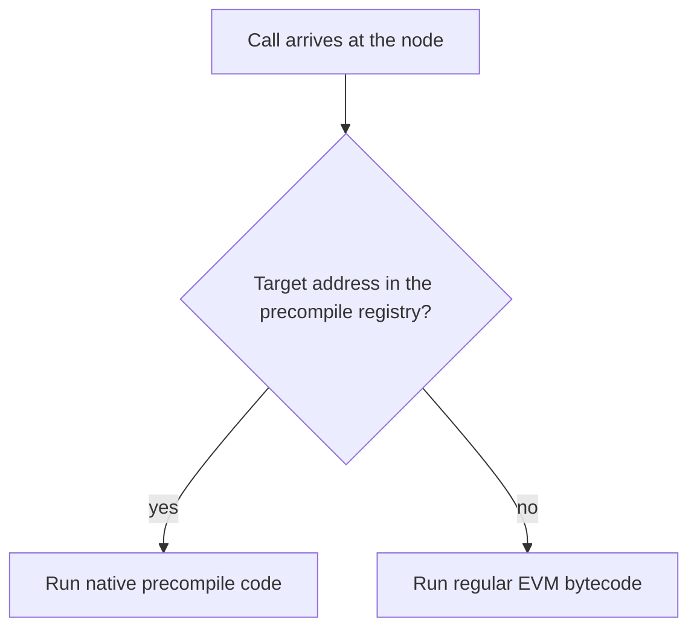
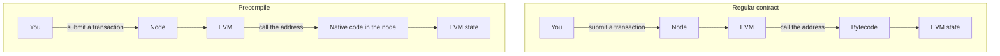
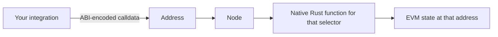
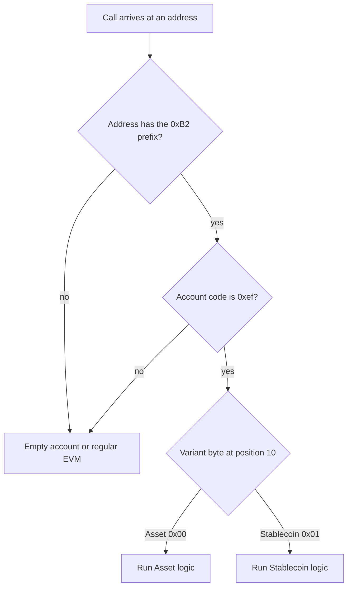
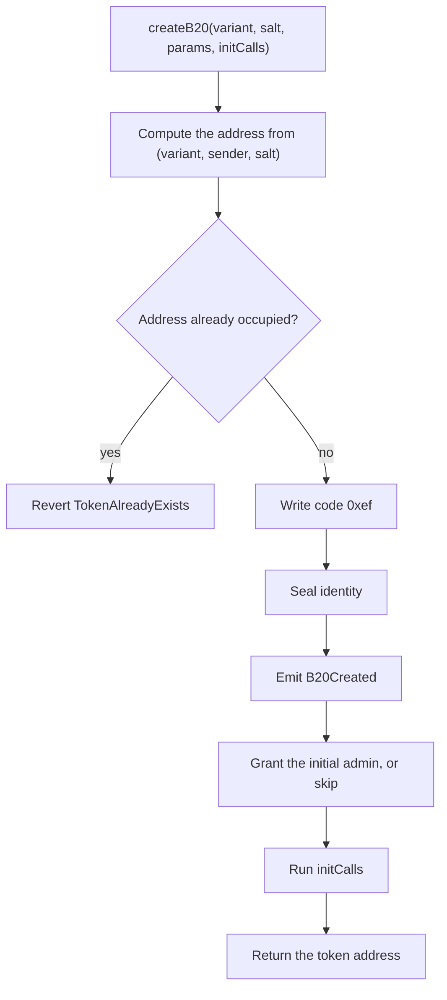
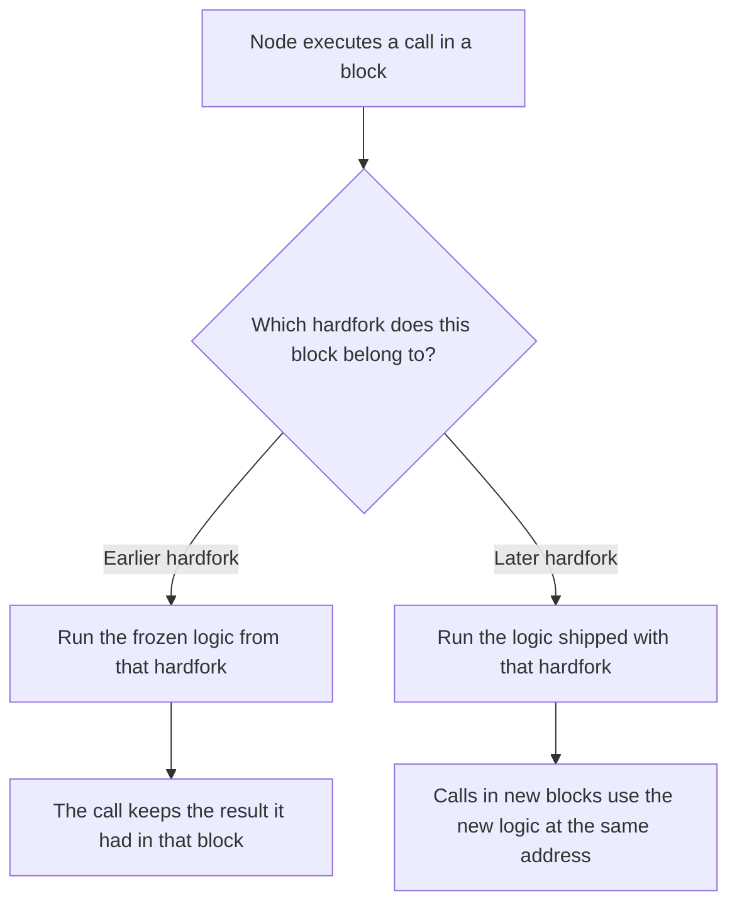

# B20 architecture for integrators

*What you need to know about how a B20 call runs: precompiles, the four surfaces, how the node recognizes a token, and how a hardfork changes later calls.*

You integrate B20 by calling an interface at an address. This page explains the execution behind that call. For the full execution model, see [How B20 executes](architecture.md). For the properties you can build against, see [Integration architecture](integration-architecture.md).

## A B20 call is a precompile

A precompile is logic compiled into the Base node. You call it with the same kind of transaction you use for a contract: ABI-encoded calldata sent to an address. The node runs the precompile as native code. The EVM interpreter does not walk that call opcode by opcode.

Ethereum already uses this path for operations such as `ecrecover` and `sha256`. Those precompiles are pure functions. B20 is the first stateful precompile on Base. It stores data in ordinary EVM account storage at its own address, and it emits events. A successful call commits that state. A revert restores the writes from that call. A later view, such as `balanceOf`, reads what the write committed. The call can also run out of gas and revert.

On every `CALL`, `STATICCALL`, and related call opcode, the node checks a precompile registry before it loads bytecode at the target. A registered address runs native code. Any other address runs ordinary EVM bytecode. An address with no bytecode and no registry entry behaves as an empty account: the call returns immediately and produces no output. A precompile address looks like that until the hardfork that introduces it.

Up to that branch, your transaction follows the normal path. You submit it, the node validates it, and the block executes it. The difference is the last step. A regular contract runs bytecode. A precompile runs native code in the client. Both read and write EVM state.

## The interface is what you call

The interfaces in this repository are the surface you encode against: `IB20`, `IB20Asset`, `IB20Stablecoin`, and the Factory, Policy Registry, and Activation Registry interfaces.

The code that serves those selectors is Rust in the node. The node supplies that logic. You do not ship a separate program with each token. The selector in the calldata picks the function. A `transfer` call runs transfer. A `createB20` call runs `createB20`.

## Four surfaces, and only tokens are dynamic

B20 has four precompile surfaces. Three are singletons: one instance each, at a fixed address in the node's static precompile table. Tokens are the dynamic surface. The Factory creates their addresses at runtime, so those addresses are not rows in the static table. The node recognizes each token when the call arrives.

| Surface | Instances | What you call it for |
| --- | --- | --- |
| Factory | One fixed address | `createB20` |
| Policy Registry | One fixed address | Shared allowlists, blocklists, and composite policies |
| Activation Registry | One fixed address | Whether a Factory or token feature is on |
| B20 token | One address per token | Balances, transfers, roles, pause, mint, burn, seize, and that token's policy checks |

Singleton addresses are listed in [Integration architecture](integration-architecture.md#2-system-surface).

A call to the Factory, the Policy Registry, or the Activation Registry matches the static table and runs that singleton. A call to a token uses the prefix and code checks below.

The Factory creates a token and then stops. After `createB20` returns, the Factory has no further access to that token.

The Policy Registry holds the shared lists. A token stores a policy ID, not the members. Many tokens can store the same ID. An update to that policy is visible to every token that stores it.

The Activation Registry is a Base-operated switch. You read it. When a feature is inactive, writes that require it revert with `FeatureNotActivated`. Reads stay available. Turning a variant off stops new `createB20` calls for that variant. Tokens that already exist keep running.

## How the node routes a call to a token

Token routing is two checks, in order. First the address must be a B20-shaped address. Then the account code must be the single byte `0xef`. Both have to pass. If either fails, the call is not a live B20, and it follows the empty-account or regular-EVM path.

The prefix is the top of the address. Byte `[0]` is `0xB2`, and bytes `[1:9]` are zero. `isB20(address)` reads that prefix and does not consult a registry. It can return true for an address the Factory has not created yet.

`isB20Initialized(address)` is the stronger check: the `0xB2` prefix and the `0xef` stub. Before creation, a predicted address matches the prefix and has no stub, so a call there returns no output. After `createB20` returns, the stub is present and routing starts.

Both variants use the same `0xef` byte. The variant comes from address byte `[10]`. Asset is `0x00`. Stablecoin is `0x01`. That byte selects Asset logic or Stablecoin logic. It does not change after creation.

## `0xef` means the Factory created the token

`0xef` is the reserved prefix from [EIP-3541](https://eips.ethereum.org/EIPS/eip-3541). Ordinary `CREATE` and `CREATE2` cannot deploy code that starts with that byte. The node does not interpret `0xef` as a program. It is a marker.

The Factory is the only creator. It writes that marker inside `createB20`. An address with the `0xB2` prefix and code `0xef` came from the Factory.

`createB20(variant, salt, params, initCalls)` is the only creation entrypoint. You pass a variant (Asset or Stablecoin), a salt, and `params` for the token metadata: name, symbol, decimals, and variant-specific fields. `initCalls` is optional. When you pass it, the Factory runs those calls on the new token in the same transaction.

The Factory computes the address from `(variant, sender, salt)`. If that account is already occupied, `createB20` reverts with `TokenAlreadyExists`. If the address is empty, the Factory writes `0xef`, seals the identity, emits `B20Created`, grants the initial admin, runs `initCalls`, and returns the address. Passing the zero address as the initial admin skips that grant.

The address itself carries the identity the router uses:

- Byte `[0]` is `0xB2`.
- Bytes `[1:9]` are zero.
- Byte `[10]` is the variant. Asset is `0x00`. Stablecoin is `0x01`.
- The remaining bytes are derived from `keccak256(sender, salt)`.

## Hardforks change later calls and leave earlier calls as they were

Base ships B20 changes as hardforks. A hardfork is a consensus upgrade. For B20, a hardfork can introduce a new precompile, or it can ship a new version of the logic at an address you already call. The Activation Registry, for example, exists from the Beryl hardfork onward.

You keep calling the same address. The node picks the native implementation from the hardfork of the block it is executing, once per call. A block from an earlier hardfork runs the logic from that hardfork, including on a node that learned about a later hardfork afterward.

Each shipped version stays frozen. A later hardfork adds a version beside it. A node that replays every block from genesis reaches the same state as a node that was live for those blocks. A transaction that already executed keeps the behavior it had when it executed.

A call reverts when the active hardfork has no version for that logic. The node does not substitute another version.

The hardfork is what puts the logic into the protocol. The Activation Registry remains a separate switch. After a hardfork introduces a precompile, the address stays in the routing path. Inactive writes revert with `FeatureNotActivated`. Reads stay available. Deactivating a variant blocks new `createB20` calls for that variant. Existing tokens keep running.

Build against the interface of the release you are on. A later hardfork can add selectors at these same addresses. Those selectors are absent until that hardfork.
