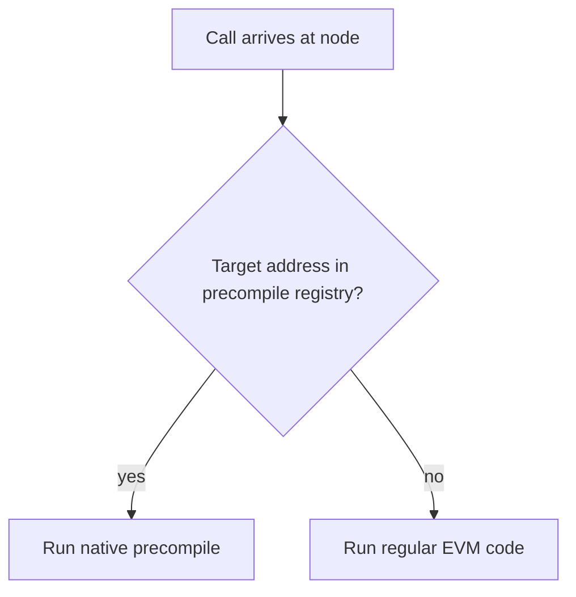
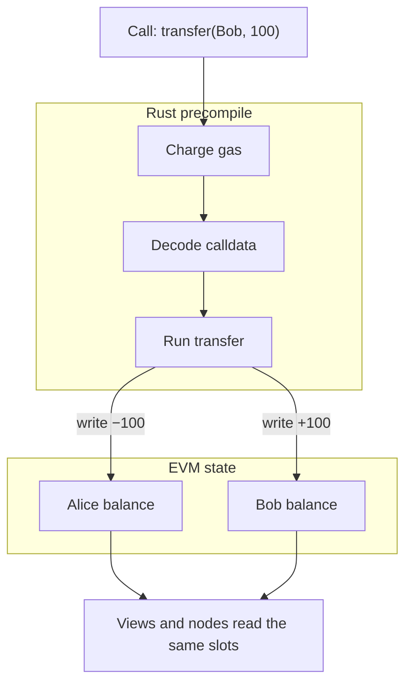

# B20 Execution Architecture

*How B20 actually executes: how its precompiles differ from ordinary contracts, how a token gets created and recognized as one, and how the protocol evolves without breaking history. For what each primitive means and how to use it (assets, roles, policies), see [Concepts](concepts/). For the "B20 in 10 minutes" tour, see [Overview](overview.md).*

## 1. How B20 Uses Precompiles

### 1.1 Normal Contracts vs Precompiles

Precompiles are code compiled into the node client. Unlike regular smart contracts, they are not deployed as EVM bytecode and the EVM interpreter does not execute them. They run as native code, so they bypass the opcode-by-opcode interpreter loop: decode, execute, update stack and memory, then repeat. That native path is why they are faster. Ethereum introduced them because some operations, such as hashing and cryptographic primitives, were too expensive to run efficiently in the EVM. Callers still see a contract-like interface.

Because the interpreter is not in the path, a precompile implements its own state access and gas accounting. State is still stored through the EVM state model, the same way regular contracts store state. Gas metering is defined by the precompile itself rather than by per-opcode interpreter costs.

The node decides which path to take. On every `CALL`, `STATICCALL`, and related opcode, the EVM checks a precompile registry before it loads bytecode at the target address. If the address is registered, native code runs and bytecode is never loaded or interpreted. If it is not registered, the node runs regular EVM code. The client identifies a precompile by a reserved address mapped in that registry.

Classic Ethereum precompiles (`ecrecover`, `sha256`, `ripemd160`, `modexp`, `ecadd`/`ecmul`/`ecpairing`, `blake2f`, and others) are looked up through this same registry. B20 does not bypass or extend the EVM dispatch path. It registers into that path. An address with no bytecode and no registry entry behaves like an empty account: the call returns immediately with no output. That is how a precompile address looks before the hardfork that introduces it.

From the outside, the two paths look the same until the EVM reaches the target. The actor submits a transaction, the node validates and gossips it, the block builder executes it, and the EVM calls the contract address. A regular contract then runs bytecode. A precompile runs native client code. Both paths read and write EVM state.

```mermaid
flowchart TB
    classDef highlight fill:#fff3b0,stroke:#d4a017,color:#000

    subgraph regular [Regular]
        direction LR
        RA[Actor] -->|submits tx| RN[Node]
        RN -->|validate and gossip| RB[Block builder]
        RB -->|executes tx| RE[EVM]
        RE -->|call contract address| RC[Bytecode]
        RC -->|read/write| RS[EVM state]
    end

    subgraph precompile [Precompile]
        direction LR
        PA[Actor] -->|submits tx| PN[Node]
        PN -->|validate and gossip| PB[Block builder]
        PB -->|executes tx| PE[EVM]
        PE -->|call contract address| PC[Native client code]
        PC -->|read/write| PS[EVM state]
    end

    class RC,PC highlight
```

### 1.2 B20's Precompiles

The Factory, the Policy Registry, the Activation Registry, and every B20 token are precompiles: native, stateful logic at a reserved address, not deployed bytecode.

- **Factory** — creates B20 tokens through a single `createB20` entrypoint.
- **Policy Registry** — holds shared allowlists, blocklists, and composite policies that tokens query for authorization.
- **Activation Registry** — a Base-operated switch that turns Factory and token features on or off.
- **B20 token** — the asset itself: balances and transfers, plus roles, pause, mint, burn, seize, and policy checks.

B20 is the first stateful precompile on Base. Classic Ethereum precompiles are pure, stateless functions. B20's precompiles hold persistent storage and emit real events. They behave as system contracts, not one-shot pure functions. The storage they read and write is the same EVM state that regular contracts use.

There are two kinds of B20 precompile: singletons and many-to-many.

Singletons have one instance at a fixed address. The Factory, Policy Registry, and Activation Registry are registered in the node's static precompile table and matched there on every call.

Many-to-many precompiles share one native implementation across many addresses. Token addresses are created at runtime, so they cannot be entries in that fixed table. The node recognizes them dynamically by decoding the address itself. How that routing works is covered in [§2](#2-how-a-token-is-created).

### 1.3 State and Execution

Once the node recognizes the target as a precompile, it routes the call to the native code registered for that address. Bytecode is never loaded.

That registered code is responsible for gas and for errors. It charges gas for calldata, `SLOAD`, `SSTORE`, and logs on the same schedule those opcodes would have paid. It also raises the same class of failures a contract would: out of gas, revert, and custom errors. Out of gas is out of gas. A revert restores EVM state the same way a normal contract revert does.

The precompile charges gas, then decodes the calldata and runs the function that selector maps to. A `transfer` call runs transfer. A `createB20` call runs createB20.

Those functions have state to update. Precompiles share state with the EVM: they write straight into the account storage at their own address, the same slots a contract would use. There is no side database. A `transfer` updates that token's balances. A later `balanceOf` or `eth_getStorageAt` is an `SLOAD` of what that write committed.

Layout is [ERC-7201](https://eips.ethereum.org/EIPS/eip-7201) at the precompile's own address: a namespace root at `keccak256(namespace) - 1`, masked to a slot boundary, fields at fixed offsets from that root, and keyed data — balances, allowances — at `keccak256(key, slot)`, the same mapping formula Solidity uses. Each precompile writes only its own account. Tokens never share a storage account. Shared lists live on the Policy Registry; the token stores only a policy ID.

Checks include activation, role, pause, and policy. Activation does not hide the address: once a hardfork introduces a precompile, the address stays in the routing table. Inactive writes revert with `FeatureNotActivated`. Reads stay available. Deactivating a variant blocks new Factory creation. Existing tokens keep running.

## 2. How a Token Is Created

### 2.1 Creating a Token
- Every token comes from one entrypoint on the Factory: `createB20(variant, salt, params, initCalls)`.
- The Factory computes the token's address deterministically, seals its identity (name, symbol, decimals, etc.), emits `B20Created`, grants the initial admin role (or skips it, to create an adminless token), then runs `initCalls` against the new token before returning its address.
- Once `createB20` returns, the Factory has no further access to the token — creation is a one-shot, one-transaction event.

### 2.2 Recognizing a B20 Token
- The address itself encodes the answer: `0xB2` prefix + variant byte + `keccak256(sender, salt)` suffix. `isB20(address)` reads that encoding directly — no registry lookup needed.
- This is also how routing works after creation: since token addresses can't be pre-registered, the node resolves them through a dynamic lookup that decodes the variant straight from the address and dispatches to the right logic (Asset vs Stablecoin) on the fly.
- Before a token is created, its address behaves like any other unregistered address — calling it is a no-op, the same empty-account behavior described in §1.1.

## 3. How B20 Evolves

### 3.1 Protocol Upgrades
- B20 changes ship as part of hardforks (e.g. Beryl → Cobalt) — the same mechanism that gates any other protocol-level change.
- A hardfork can introduce an entirely new precompile (the Activation Registry itself only exists from Beryl onward) or a new logic version for an existing one.

### 3.2 Logic Versions
- Each precompile's logic is versioned. Once a version ships, it's frozen forever — self-contained, with no shared mutable state or traits across versions.
- Why: editing logic in place at a fixed address would change execution for historical blocks too, breaking replay from genesis. Freezing is what preserves consensus.

### 3.3 Fork / Version Resolution
- A hardfork resolves to a specific logic version (fork → version enum → frozen implementation) — resolved once per call, never "whatever is current."
- A call reverts if no version is resolved for the active fork (calling logic that doesn't exist yet), rather than silently falling back to a default.

### 3.4 Adding New Functions
- New functionality ships as a new frozen version alongside the old ones — never by editing an existing version in place.
- Additive-only guarantee: a hardfork can add selectors, events, and errors; it never removes or changes ones that already shipped.

### 3.5 ABI Evolution
- The logic interface itself is append-only: new versions may add methods, never remove or change existing signatures.
- Deprecated symbols are kept, not deleted (e.g. `burnBlocked`, the instant `updateMultiplier`) — old callers keep working unchanged.

### 3.6 Historical Execution
- Old transactions replay deterministically: the dispatcher resolves the version that was active *at that block's fork*, not "current" logic — so replaying history always re-executes the version that was live at the time.

### 3.7 Backwards Compatibility
- Nothing that already shipped changes meaning — existing selectors, events, and errors keep their exact semantics across every later fork.
- Consumers integrated against an old version keep working after a new version ships alongside it. They simply don't get new capabilities until they adopt the new ABI surface.
