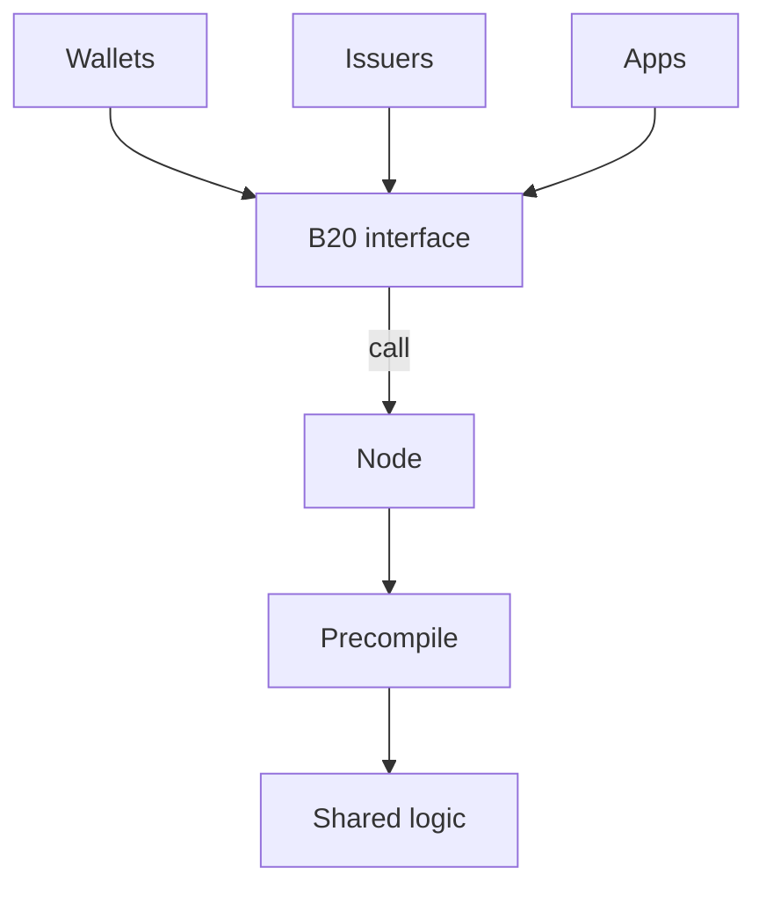
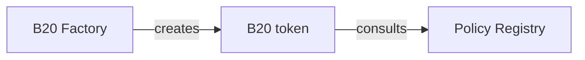
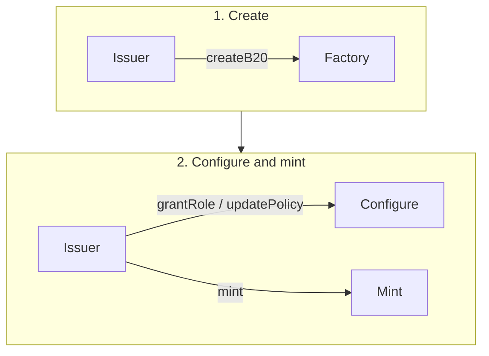

“B20 in 10 Minutes.” Very readable, probably 5–10 minutes.

It answers:

What is B20?
Why does it exist?
What problems does it solve?
Where does it sit in Base?
What is a B20 Asset?
What are policies?
What does a basic transaction look like?
Where should I go next?

Someone should be able to read just this and explain B20 at a high level.

# B20 Overview

B20 is Base's native token standard for issuing and managing programmable assets onchain.

This document provides a high-level introduction to B20: what it is, why it exists, the core primitives it exposes, and how those pieces fit together.

For a deeper technical explanation, see [How B20 Works](./architecture.md).

---

## What is B20?

B20 is Base's native token standard for issuing and managing programmable assets onchain. Base created it to standardize real-world asset (RWA) and stablecoin issuance. B20 is an ERC-20 superset: balances, transfers, and approvals work like ERC-20, and every B20 asset shares the same additional interfaces and protocol logic rather than each issuer deploying a custom token implementation.

The standard also includes compliance and administrative controls. Issuers can configure roles and permissions, attach policies, mint and burn supply, pause operations, and perform other administrative actions that regulated-asset workflows typically require.

B20 runs as precompiles in the Base node, not as per-token Solidity. Wallets, issuers, and apps call ERC-20-style interfaces; the node runs the shared B20 logic natively. Base upgrades that logic through hardforks, so every caller gets consistent behavior and native execution across all B20 assets.

### At a Glance

You call a B20 asset the same way you call any other contract: through its interface at the asset address. Every B20 asset uses that same interface and the same precompile logic, so integrators have one source of truth.

---

## Why B20?

Real-world asset (RWA) issuance onchain needs a shared token standard with compliance built into the asset. ERC-20 covers balances, transfers, and approvals. Regulated assets also need eligibility checks, roles, mint and burn, pausing, and other administrative controls. Issuers rebuild those primitives for almost every tokenized asset.

Issuers who implement that stack themselves repeat the same logic, diverge in behavior, and force every wallet and app to integrate a custom token. B20 is the alternative: you create a B20 asset and configure its roles and policies instead of writing and maintaining a one-off token. Compliance is a first-class primitive, not an add-on each issuer designs around transfers.

A single standard also helps integrators and issuers. Wallets and apps integrate against one interface. Issuers can use shared services, such as oracles, without designing a new integration for each asset.

---

## Core Mental Model

Three services matter when you issue or use a B20. Each has one job. A fourth singleton, the Activation Registry, is a Base-operated safety switch that turns these features on; issuers and apps do not operate it.

The Factory creates tokens. Each token holds balances and configuration for one asset. The Policy Registry answers whether an account is allowed under a given policy.

### B20 Factory

The Factory is a singleton precompile. Every B20 token is created through it. At creation you choose a variant: Asset, for general-purpose issuance including RWAs, or Stablecoin, for a fiat-pegged token with a fixed currency code.

The Factory does not hold balances, assign roles, or decide who may transfer. It creates the token and retains no ongoing access.

### B20 token

The token is the asset. The issuer creates it through the Factory and maintains it. It holds balances and supply, and it exposes the ERC-20 surface plus administrative controls: mint, burn, pause, seize, and metadata.

[Roles](./concepts/roles.md) live on the token. They answer who may call those privileged operations on this asset. They are not a separate registry.

Asset and Stablecoin share this model. They differ in a few variant-specific fields, not in how issuance, roles, or policies work. See [Assets](./concepts/assets.md).

### Policy Registry

The Policy Registry is a singleton precompile that stores reusable authorization policies. The token does not keep membership lists. It stores which policy applies to an operation, then asks the registry whether the relevant account is allowed.

The token owns which rule applies. The registry owns whether an account satisfies that rule. One policy can be attached to many tokens.

See [Policies](./concepts/policies.md). For how a call moves through these services, see [How B20 Works](./architecture.md).

---

## Bringing a B20 Asset into Use

An issuer follows this sequence.

1. The issuer creates an asset through the Factory. The asset now exists: it has a name, a symbol, a variant, and an initial admin.
2. The issuer configures roles and policies on the asset and mints units to holders. The asset allows the mint only if the caller has the mint role and the recipient is allowed by policy.
3. Holders who received those units can transfer them to other accounts. The asset allows each transfer only if the sender and the recipient are allowed by policy.

---

## How a B20 Operation Works

Show one extremely simple transaction path.

Example:

User / Application
       |
       | transfer(...)
       v
   B20 Asset
       |
       v
Authorization / Policy Checks
       |
       v
State Transition
       |
       v
Events

Then explain:

- applications submit a B20 operation
- B20 evaluates the relevant authorization and policy rules
- if valid, canonical state changes
- events expose the resulting transition to downstream systems

This prepares readers for architecture.md.

---

## Example: Issuing and Transferring an Asset

Use one example throughout the documentation.

For example:

> ACME creates `ACME-TBILL`, a token representing units of a treasury product.

Walk through:

1. ACME creates the asset.
2. ACME configures the appropriate permissions.
3. ACME attaches a holder eligibility policy.
4. ACME issues 1,000 units to Alice.
5. Alice transfers 100 units to Bob.
6. B20 evaluates whether Bob satisfies the required policy.
7. If allowed, balances are updated and the relevant events are emitted.

The point isn't to show code.

The point is to connect all the concepts introduced above.

---

## B20 in the Base Stack

Show where B20 sits.

Application / Wallet / Backend
            |
            v
       B20 Interface
            |
            v
      B20 Precompiles
            |
            v
      Base Execution
            |
            v
      Canonical State

Explain the separation between:

- application-facing interface
- B20 protocol functionality
- underlying Base execution

This should be enough context for readers before they enter architecture.md.

---

## Who Builds Against B20?

Very briefly introduce your three audiences.

### Integrators

Applications, issuers, wallets, backends, or other systems that interact with B20 assets.

→ [Integrator Guide](./guides/integrators.md)

### Indexers

Systems that ingest B20 events and state to provide APIs, analytics, explorers, portfolio views, or other derived data.

→ [Indexer Guide](./guides/indexers.md)

### Implementers

Engineers working on B20 execution, client support, precompiles, testing, upgrades, or protocol behavior.

→ [Implementer Guide](./guides/implementers.md)

---

## Where to Go Next

If you want to understand how B20 works internally:

→ [B20 Architecture](./architecture.md)

If you are integrating B20:

→ [Integrator Guide](./guides/integrators.md)

If you are indexing B20:

→ [Indexer Guide](./guides/indexers.md)

If you are implementing B20:

→ [Implementer Guide](./guides/implementers.md)

For exact interfaces and protocol definitions:

→ [Reference](./reference/)
→ [Specifications](./specs/)