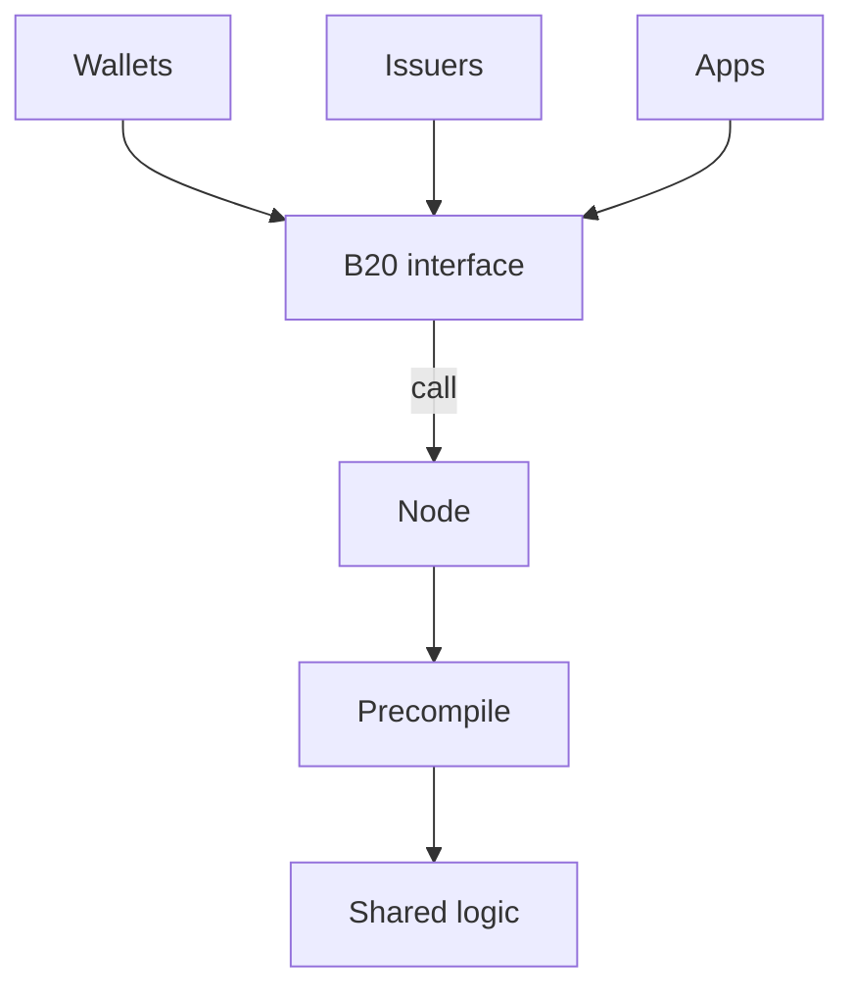
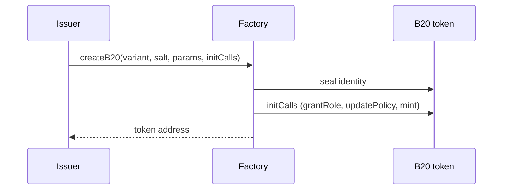
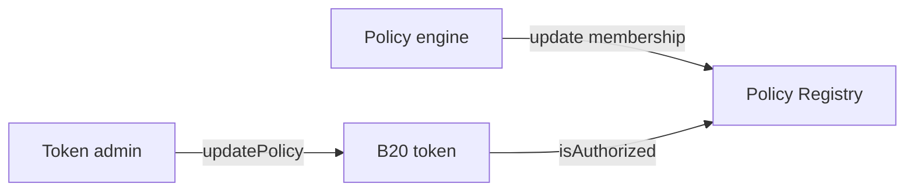
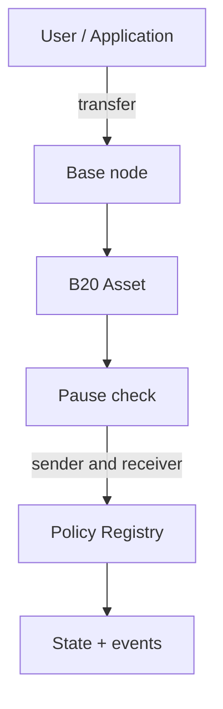
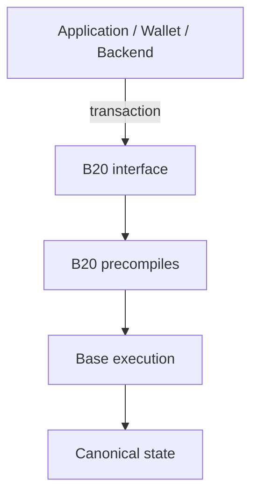

“B20 in 10 Minutes.” Very readable, probably 5–10 minutes.

It answers:

What is B20?
Why does it exist?
How does the Factory create an asset?
How do roles and pause work?
How do compliance checks integrate?
Where does B20 sit in the Base stack?
Where should I go next?

Someone should be able to read just this and explain B20 at a high level.

# B20 Overview

B20 is Base's native token standard for issuing and managing programmable assets onchain.

This document provides a high-level introduction to B20: what it is, why it exists, the core primitives it exposes, and how those pieces fit together.

For a deeper technical explanation, see [How B20 Works](./architecture.md).

---

## What is B20?

B20 is Base's native token standard for issuing and managing programmable assets onchain. Base created it to standardize real-world asset (RWA) and stablecoin issuance. B20 is an ERC-20 superset: balances, transfers, and approvals work like ERC-20, and every B20 asset shares the same additional interfaces and protocol logic rather than each issuer deploying a custom token implementation.

The standard also includes compliance and administrative controls. Issuers can configure roles and permissions, attach policies, mint and burn supply, pause operations, and perform other administrative actions that regulated-asset workflows typically require.

B20 runs as precompiles in the Base node, not as per-token Solidity. Wallets, issuers, and apps call ERC-20-style interfaces; the node runs the shared B20 logic natively. Base upgrades that logic through hardforks, so every caller gets consistent behavior and native execution across all B20 assets.

### At a Glance

You call a B20 asset the same way you call any other contract: through its interface at the asset address. Every B20 asset uses that same interface and the same precompile logic, so integrators have one source of truth.

---

## Why B20?

Real-world asset (RWA) issuance onchain needs a shared token standard with compliance built into the asset. ERC-20 covers balances, transfers, and approvals. Regulated assets also need eligibility checks, roles, mint and burn, pausing, and other administrative controls. Issuers rebuild those primitives for almost every tokenized asset.

Issuers who implement that stack themselves repeat the same logic, diverge in behavior, and force every wallet and app to integrate a custom token. B20 is the alternative: you create a B20 asset and configure its roles and policies instead of writing and maintaining a one-off token. Compliance is a first-class primitive, not an add-on each issuer designs around transfers.

A single standard also helps integrators and issuers. Wallets and apps integrate against one interface. Issuers can use shared services, such as oracles, without designing a new integration for each asset.

---

## Creating a B20 Asset

Every B20 token is created through the Factory, a singleton precompile. You submit `createB20` to a Base node the same way you submit any other contract call.

1. The issuer calls `createB20` with a variant, a salt, and creation parameters (name, symbol, initial admin, and variant-specific fields).
2. The Factory assigns a deterministic address from `(variant, sender, salt)` and seals the token's identity.
3. Optional `initCalls` run on the new token so the issuer can grant roles, attach policies, or mint in the same transaction.
4. `createB20` returns. The Factory retains no ongoing access to the token.

Choose **Asset** for general-purpose issuance, including RWAs, or **Stablecoin** for a fiat-pegged token with a fixed currency code. Both variants share roles, policies, and the ERC-20 surface. See [Assets](./concepts/assets.md).

The Activation Registry is a Base-operated safety switch that turns Factory and token features on. Issuers and apps do not operate it.

---

## Configuring Roles

Privileged operations on a token use [OpenZeppelin AccessControl](https://docs.openzeppelin.com/contracts/5.x/access-control). Roles live on the token. They are not a separate registry.

The admin grants and revokes roles with the standard AccessControl methods: `grantRole`, `revokeRole`, `renounceRole`, and `setRoleAdmin`. `DEFAULT_ADMIN_ROLE` is the top-level admin. It is the role required to grant other roles, attach policies, and set the supply cap.

| Role | Gates |
| --- | --- |
| `DEFAULT_ADMIN_ROLE` | `grantRole`, `revokeRole`, `setRoleAdmin`, `updatePolicy`, `updateSupplyCap` |
| `MINT_ROLE` | `mint` |
| `BURN_ROLE` | `burn` |
| `SEIZE_ROLE` | `seizeWithMemo` |
| `PAUSE_ROLE` / `UNPAUSE_ROLE` | `pause` / `unpause` |
| `METADATA_ROLE` | name, symbol, and contract URI updates |

The Asset variant also has `OPERATOR_ROLE` for announcements and multiplier updates. See [Roles](./concepts/roles.md).

Pause is per feature, not global. `PAUSE_ROLE` can pause any of four vectors: `TRANSFER`, `MINT`, `BURN`, and `SEIZE`. `UNPAUSE_ROLE` is a separate role, so the account that pauses does not have to be the account that resumes. `approve` is not pause-gated.

Holder `transfer` is not role-gated. Anyone who holds units can transfer them, subject to pause and policy.

---

## Integrating Compliance Checks

The Policy Registry is a singleton precompile that stores reusable allowlists, blocklists, and composite policies. The token does not keep membership lists. It stores which policy applies to an operation, then asks the registry whether the relevant account is allowed.

A compliance system connects as a **policy engine** by administering membership on the registry. The token admin binds that policy to a scope with `updatePolicy`. One policy can be attached to many tokens. The token never calls the engine; the engine writes to the registry, and the node reads `isAuthorized` when it executes the call.

### Transfer control path

You submit a transfer the same way you submit any other onchain call: as a transaction to a Base node, targeting the asset address.

1. A wallet or application submits a transaction that calls `transfer` on the asset.
2. The node executes the call. If `TRANSFER` is paused, the transaction reverts.
3. The asset reads the policy IDs on `TRANSFER_SENDER_POLICY` (`from`) and `TRANSFER_RECEIVER_POLICY` (`to`), then asks the Policy Registry whether each account is authorized. `transferFrom` also checks `TRANSFER_EXECUTOR_POLICY` against `msg.sender`.
4. If those checks pass, the node updates balances and emits `Transfer`. If a check fails, the transaction reverts and state does not change.

Slots default to always-allow until the admin attaches a policy. `approve` is not policy-gated. See [Policies](./concepts/policies.md).

---

## B20 in the Stack

A B20 call uses the same submission path as any other contract call. The node runs shared precompile logic instead of per-token bytecode.

- **Application-facing interface.** Wallets and apps call ERC-20-style functions at the asset address.
- **B20 precompiles.** The Factory, each token, and the Policy Registry are node-native. Every asset shares the same logic.
- **Base execution.** The node applies authorization, policy, and pause checks, then commits canonical state and events.

[How B20 Works](./architecture.md) walks this path through the dispatcher, version resolution, and storage.

---

## Where to Go Next

If you want to understand how B20 works internally:

→ [B20 Architecture](./architecture.md)

If you are integrating B20:

→ [Integrator Guide](./guides/integrators.md)

If you are indexing B20:

→ [Indexer Guide](./guides/indexers.md)

If you are implementing B20:

→ [Implementer Guide](./guides/implementers.md)

For exact interfaces and protocol definitions:

→ [Reference](./reference/)
→ [Specifications](./specs/)